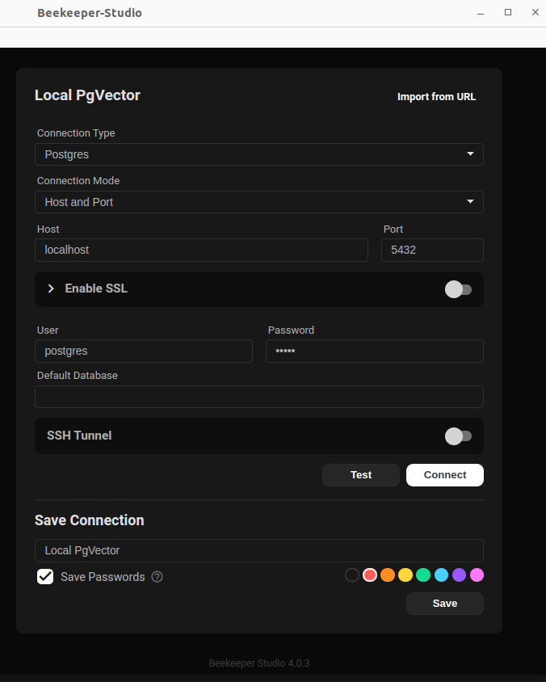

# PG Vector Study
Explorando as funcionalidades do uso de um banco de dados híbrido

## Como executar
### 1: Clone o repositório
No  terminal, execute:
- git clone https://github.com/DadosComCafe/pgvector-study.git
- cd pgvector-study

### 2: Suba os containers do banco de dados vetorial
No terminal, execute:
- docker compose up --build

#### __Explicação:__
Ao executar o comando docker, será criado um serviço chamado `postgres_vector`, que é um container criado a partir da imagem base `pgvector/pgvector:pg17`. Como no no arquivo yaml há as declarações de volume (linhas 13 a 15), no momento do build, será executado, dentro do container, o arquivo sql `sql/create_table.sql`. Desta forma, será criado uma tabela vetorial, equivalente a:

    CREATE TABLE IF NOT EXISTS Acessos (
    id SERIAL PRIMARY KEY,
    code INT NOT NULL UNIQUE,
    descricao TEXT NOT NULL,
    data_criacao DATE DEFAULT CURRENT_DATE,
    embeddings VECTOR(1536)
    );

E a extensão, para habilitara o "comportamento vetorial" será possível devido a este trecho no arquivo `create_table.sql`:

    CREATE EXTENSION IF NOT EXISTS vector;

### 3: Acesse o container no seu gerenciador de banco de dados preferido:

- __Usando o beekeeper:__

- Como o nosso container subiu com as configurações contidas em `.env_sample`, estas mesmas configurações devem ser usadas no gerenciador de banco de dados:

        POSTGRES_PORT=5432
        POSTGRES_USER=postgres
        POSTGRES_PASSWORD=senha
        PORT=5432
